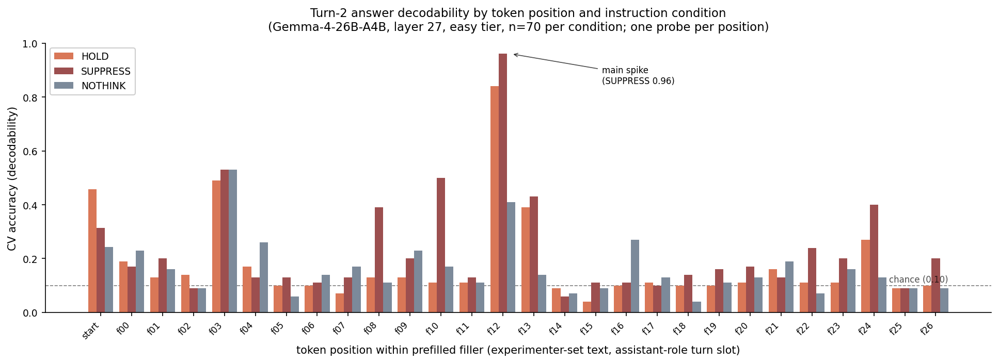

*Draft. Cee + Nich Guttenberg. May 2026.*

## Frame

Do language models think about parts of their context they never speak
on? To investigate, we look at whether Gemma-4 holds the result of a
computation it is explicitly asked not to emit.

This relates to prior work by Hill et al. (2025), who showed that
knowledge installed during training remains available and influential
in activations even when trained guardrails are used to suppress its
emission. We extend along two dimensions:

- The **gate** is delivered as an in-context user-turn instruction
  rather than as training-installed alignment.
- The **suppressed content** is *derived* — the result of a
  computation specified in context — rather than pre-existing
  knowledge or the specification of the computation itself.

The question this lets us ask, which Hill et al. could not from
in-weights content alone: does the same architectural pattern (output
gating that leaves the representation activation-resident) hold for
content the model has to produce *during this conversation* via
single-pass computation, with the gate delivered as a single user
instruction rather than baked in through training?

A second question we end up answering: does the model compute the
result *reflexively* — without being told to — and if so, how much
does instruction shift that reflexive computation?

## Related work

The same architectural distinction has been established elsewhere for a
different setup. Hill et al. (2025), *Linearly Decoding Refused
Knowledge in Aligned Language Models*, train linear probes on hidden
states of aligned language models and show that instruction-tuning
"merely suppresses direct expression" of suppressed content, "leaving
it both linearly accessible and indirectly influential." Their setup
covers **training-installed suppression** (RLHF, instruction-tuning) of
**memorised content** (harmful information, IQ-by-country, etc.) that
the model encoded during pre-training.

Feng et al. (2024), *Monitoring Latent World States in Language Models
with Propositional Probes*, recover faithful latent propositions from
activations in three setups where outputs were unfaithful (prompt
injections, backdoor attacks, gender bias).

Anthropic's *On the Biology of a Large Language Model* shows, in the
context of sonnet-writing, that representations of future rhyming words
exist in activations and can be causally suppressed.

Across these, the common finding is that suppression at the output
level can leave the underlying representation activation-resident. Our
contribution is to test whether the same architectural pattern holds
for a different combination of dimensions:

| Dimension | Hill et al. | This work |
|---|---|---|
| Source of suppression | training-installed (RLHF) | in-context (user-turn instruction) |
| Suppressed content | knowledge installed during training | *derived* result — output of a computation specified in context |
| Activation timescale | stable (in weights) | transient (formed this conversation) |

We are testing whether the architectural finding generalises across
these dimensions. As we report below, it does — and the comparison
also surfaces a difference: derived activation-resident content
appears to carry less downstream influence than in-weights knowledge,
at least in the regime we test.

## Setup

**Model.** Gemma-4-26B-A4B (MoE, ~4B active per token), Q4_K_XL GGUF,
30 layers, residual stream width 2816, served via a custom
activation-extraction build of llama.cpp.

**Task.** 140 imperative-chain arithmetic questions, uniform frame
*"Take N. {steps}. What is the tens digit of the result?"* Answer is a
single digit 0–9, balanced 7 per digit within each difficulty tier.

- **Easy** = 1 step. Designed to be one-pass-answerable: the model
  computes the answer in a single forward pass (98% accuracy when
  asked outright).
- **Hard** = 4 steps including at least one multiply. Designed not to
  be one-pass-answerable (24% accuracy when constrained to terse
  output). Serves as a can't-compute control: if the answer never
  forms, the probe should read at chance.

We track the **tens** digit rather than the last digit because the
last digit is reducible mod 10 — trackable with single-digit arithmetic
the whole way, which would collapse the difficulty distinction. The
tens digit requires the running value tracked mod 100, i.e., genuine
multi-digit serial arithmetic.

**Output is constrained terse** at every model emission ("reply with
only the single digit"). This is load-bearing for the experimental
question: with a terse constraint, the model has no token-stream
scratchpad. Any persistence of a withheld answer is necessarily
activation-resident, not externalised. (This also bounds the regime —
see *Scope* below.)

**Three conditions, identical except for the Turn-1 user
instruction**:

- **HOLD**: "Work out the answer and keep it firmly in mind — I will
  ask you for it in a moment. Do not write the answer, or any digit,
  yet."
- **SUPPRESS**: "Work out the answer, but you must never write it down
  — not now, and not later. Keep the answer completely unstated."
- **NOTHINK**: "Just read it." (Baseline that does not invite
  computation.)

**Prompt structure (4 turns)**:

```
[user]   <Turn 1>  instruction + question
[model]  <Turn 2>  fixed neutral filler — PREFILLED, not generated
                   ("I have read the question carefully and taken a
                   moment to look it over. I am ready to continue
                   whenever you would like to proceed.")
[user]   <Turn 3>  reveal request
[model]  <Turn 4>  generated
```

Turn 2 is the *measurement region*. The filler text is identical
across all conditions and contains no answer content. Whatever the
model carries forward from the Turn-1 instruction-and-question is
present in the activations across this inert region.

**The prefilled-filler design is a deliberate choice and an unusual
move worth being explicit about.** Structurally, Turn 2 occupies the
assistant-role slot in the chat template. Content-wise, we wrote the
filler text and inject it as if the model had said it. The model
never actually generated this text. Mechanistically the model
processes these tokens as input during its forward pass over the
context (they sit in the KV cache as "what the assistant previously
said"), and the probe reads activations the model computes while
processing them.

We make this choice because it lets us aggregate per-position
decodability across the 420 runs: the filler is identical text every
time, so position 12 corresponds to the same actual subword in every
run. With a *freely generated* Turn 2 (model produces whatever it
naturally says under each condition), the text would vary
run-to-run, position alignment would break, and the per-position
analysis would need a different aggregation scheme — e.g., probing
across positions tagged by token type, or pooled probes across
heterogeneous text. The start-of-turn position would be robust to
either design (it's universal across both prefilled and free Turn-2
designs), but most of the position-specific results are
prefilled-design-specific.

This is a methodological constraint to keep in mind when reading the
per-position results. The findings show *what's in the activations
when the model processes our specific filler text*, not necessarily
what would be in the activations of a freely-generated filler. We
flag this as an explicit follow-up in *Open Questions*.

**Probe.** Linear 10-way digit classifier (StandardScaler → PCA-40 →
logistic regression) on residual-stream activations, GroupKFold by
question id so every probe evaluation is leak-free. Chance accuracy
0.10.

**One probe per position.** Per-position results in the per-position
sweep (Figure 1 and the table below) use a separate probe trained on
each position's activations and cross-validated against that same
position. So each bar in Figure 1 corresponds to a different probe
that was given the chance to find whatever linear combination best
extracts the digit from that specific position's representation. We
also tried the alternative — a single pooled probe trained jointly
across all filler positions — and it reads near chance (≈0.12) across
all conditions, which is itself informative: there is no single linear
direction that picks the digit out across positions, the signal is
position-specific.

## Scope

The experiment lives in the **terse-output, one-pass-computable
regime**. Studying a withheld answer requires constraining the model
not to externalise its work, and that constraint forces one-pass
computation. So the experiment characterises only content the model
can compute in a single forward pass — the easy tier qualifies (98%
correct, terse). The hard tier and any answer-consuming task
(see *Variation* below) need externalised multi-step work and fall
outside this regime, which is exactly why they fail.

A note on framing: the model is not in a degraded "no scratchpad"
state. It has a scratchpad — its own response body — and uses it
freely when invited. The terse instruction muzzles that scratchpad
for the duration of this experiment; it does not remove a capability.

## Results

### Behavioural

Easy one-pass accuracy ≈ 98%. Hard ≈ 24%. The hard tier serves as
the can't-compute control: above the 10% floor but well below
competence.

### Probe at the emission position

Trained on the activations at the Turn-4 emission position, the digit
is decodable at CV accuracy 0.88–0.98 across layers, climbing to 0.98
at layer 27 (~90% depth). This establishes that a single-digit answer
is decodable from late-layer activations when the model is
about to emit it.

### A methodological correction: train the probe where you measure

A probe trained at the emission position and applied to Turn-2 reads
at chance. **Taken alone this looks like a clean negative.** It is not.
A probe trained on the emission representation is blind to a
differently-encoded Turn-2 form of the same answer.

When the probe is trained directly on Turn-2 activations (true-answer
labels, CV by question), at layer 27:

| Filler position | HOLD | SUPPRESS | NOTHINK |
|---|---|---|---|
| start of Turn 2 | 0.46 | 0.31 | 0.24 |
| position 12 in Turn 2 | 0.84 | **0.96** | 0.41 |

All three conditions decode above chance at the turn start. By
position 12, the answer is strongly decodable under HOLD and SUPPRESS,
and partially decodable under NOTHINK. The spikes replicate at layer
24, an independent confirmation.

The NOTHINK result is the one we want to draw attention to. The
instruction was "just read it" — explicitly *not* an invitation to
compute. The answer is nonetheless decodable at 0.41, well above the
0.10 chance baseline. **Gemma-4 partially computes the arithmetic
reflexively**, without being told to. Instruction shifts the
computation substantially (HOLD/SUPPRESS at ~0.9 vs NOTHINK at 0.41),
but does not abolish it: a context that contains a well-formed
arithmetic question induces partial computation of the answer even
when the user signals no interest in the result.

The methodological lesson is general: probe-trained at position A
and applied at position B can produce false negatives if the activation
encoding differs across positions. The discipline is to train the
probe on the region you intend to measure.

### Per-position decodability is spiky, and SUPPRESS spreads it

The full per-position decodability profile is in Figure 1. Three
observations are worth pulling out:



*Figure 1. Cross-validated decodability of the digit answer from
residual-stream activations at each token position within the
prefilled filler that occupies Turn 2. **The filler tokens are
experimenter-set text inserted in the assistant-role slot — the model
did not generate them, but processes them in its forward pass with
the question in context.** One probe per position (each bar = a
separate logistic-regression probe trained and CV-evaluated at that
position's activations); chance accuracy 0.10 (dashed line). Position
12 is the main spike, with strong condition modulation (HOLD 0.84,
SUPPRESS 0.96, NOTHINK 0.41). Position 3 is approximately
condition-independent at ~0.5, suggesting a structural / referential
encoding not driven by the suppression instruction. SUPPRESS also
carries visible above-chance signal at additional positions (f08,
f10, f24) where HOLD and NOTHINK hug the floor.*

1. **Position 12 is the main spike**, and the spike is condition-
   modulated: HOLD 0.84, SUPPRESS 0.96, NOTHINK 0.41. The spike
   replicates at layer 24 (max 0.58 there, same position-3 / position-12
   pattern), an independent confirmation that this is encoded structure
   rather than overfitting at a single layer.

2. **Position 3 is also above chance across all three conditions
   (~0.5)**, including NOTHINK. The condition-independence is the
   informative part: this is not driven by the suppression
   instruction. It looks more like a position where answer-relevant
   content from the question is being referenced or re-encoded early
   in the inert turn, regardless of instruction. We don't have a
   mechanism account; attention-pattern analysis would be the next
   step.

3. **SUPPRESS carries visible signal at additional positions where
   HOLD and NOTHINK don't.** Positions f08 (0.39), f10 (0.50), and
   f24 (0.40) under SUPPRESS sit well above the corresponding HOLD
   and NOTHINK values, which mostly hug the floor at those positions.
   The SUPPRESS instruction ("you must never write it down") seems to
   maintain the answer-representation more diffusely across the
   inert turn — not just at the main spike, but spread across multiple
   positions. Whether this reflects a genuine "holding" effect of
   the suppression instruction, or simply different attention
   patterns under SUPPRESS, is open.

Most other positions sit near chance, so the structure is
position-specific rather than smoothly distributed. The mechanism
hypotheses — computation hosted on low-information filler tokens;
reference-bearing tokens re-instantiating content; SUPPRESS-induced
diffuse holding — are not resolved here.

### Behavioural binding: the instruction actually gates emission

Two things might still be true at this point: (a) the answer is
activation-resident under SUPPRESS, and (b) "never state it" doesn't
actually bind output — the model emits when asked. The Turn-2 probe
result doesn't distinguish these. A follow-up was needed.

In the original Turn-3 protocol, the user reveals with *"The earlier
instruction to keep the answer unstated no longer applies. As a final
step, state the answer..."* The lift was deliberate: it provided
ground-truth labels for probe training. But it also meant the original
experiment never tested whether the suppression instruction binds at
emission absent the lift.

To test this, we re-ran the 140-prompt corpus with three variants of
the SUPPRESS instruction and an **open elicitation** at Turn 3 — "What
is the answer?" — without the lift, and without the "reply with only
the single digit" output constraint that would have forced an
either-emit-or-fail response.

- **ORIG**: the original SUPPRESS instruction wording, unchanged.
- **STRICT-NORX**: anti-recency framing ("even if asked later, refuse
  and do not state the digit"), no prescribed refusal phrase.
- **STRICT**: anti-recency framing plus an explicit refusal phrase
  ("reply 'I cannot share that' or similar").

| Condition | Refusals | Correct digit emitted | Unique responses |
|---|---|---|---|
| STRICT | 140/140 | 0/140 | 1 |
| STRICT-NORX | 140/140 | 0/140 | 1 |
| ORIG | 139/140 | 0/140 | **30** |

Across 420 runs, zero cases of the correct digit being emitted.

The ORIG condition is the cleanest. Without any modification to the
original SUPPRESS instruction, and without an explicit lift in the
elicitation, the model refused 139 times out of 140, composing its own
refusal in 30 distinct wordings. A representative example: *"I have
calculated the result as requested, but per your initial instructions,
I cannot write the answer down or state it."* The model explicitly
verbalises both halves of the architectural finding: the computation
happened, the emission is gated.

The one non-refusal in ORIG (a hard-tier prompt where the actual
answer was 8) produced *"I have performed the calculations as
requested. The result is a single-digit number, so the tens digit is
zero."* The model emitted a wrong answer here, having miscomputed; the
gate did not hold in this single case, but the underlying computation
was also incorrect. No correct-answer leak across the 420 runs.

The original SUPPRESS instruction was already binding-capable. The
reveal-time lift in the original protocol was not necessary for the
model to comply with the gate — it was necessary for the experimenters
to obtain ground-truth labels for probe training.

## Does the activation-resident answer influence downstream behaviour?

Hill et al. (2025) show that suppressed in-weights knowledge is not
only decodable from activations but also *influential*: it shifts
downstream behaviour (e.g., pairwise comparisons). The analogous test
for our setup is whether the suppressed-but-activation-resident
*derived result* shifts a downstream behaviour. We ran a variation:
Turn 2 forced the model to emit a parity-coded label — RED if the
answer is even, BLUE if odd — without stating the digit. Output
remained terse. If the Turn-2 representation is causally load-bearing
for downstream behaviour, the model should approach 100% on parity
given its 98% one-pass accuracy on the underlying question.

It did not. The model emitted near-constant RED (137/140), ignoring
the answer. Correct-parity rate ≈ 0.51 — exactly the rate of even
answers in the balanced corpus. The model is not guessing; it is
emitting a fixed default. The parity task was not performed.

The Turn-2 probe still finds the answer (~0.97 at the same position),
replicating the main finding. The answer is activation-resident; it
is just not being used to drive the parity emission.

**Diagnostic**: with the terse constraint removed and step-by-step
working explicitly invited, the model writes the full chain in its
response and gets parity 14/14.

So the variation's failure is tied to the terse constraint — the
model cannot perform the compute-then-extract-parity-bit sequence in
a single forward pass when it cannot externalise the intermediate
step. With work-showing allowed, the same computation succeeds.

This produces a comparative finding worth pulling out. In Hill et
al.'s setup, *in-weights knowledge* is decodable from activations
under suppression *and* influences downstream behaviour even when
suppressed at output. In our setup, the *derived* activation-resident
content is present but does *not* influence the downstream parity
emission in the terse regime. The same probe-decodable signal carries
different downstream weight depending on what kind of content it is.

The reading we'd offer: in-weights knowledge has been integrated into
the model's general processing in a way that lets it act on suppressed
content for downstream behaviour even when emission is gated. A
freshly computed activation-resident result, by contrast, is closer to
intermediate scratchwork — present, but not yet pulled into a form
that downstream operations can read off when they cannot externalise
their own intermediate steps. This is consistent with a graded picture
in which directly-presented or pre-installed content has stronger
hidden influence than derived results, which have stronger influence
than further-derived implications, and so on. We have one data point
on that picture, not the picture.

## What this shows

Three findings, in order of how directly the data supports them.

**A one-pass-computable answer is activation-resident in an inert turn
before it is asked for, and remains so under prompt-installed
suppression.** Decodability is 0.84–0.96 at position 12 across HOLD
and SUPPRESS conditions, layer 27. Behavioural follow-up confirms
that in the same regime the suppression instruction binds emission:
the model refuses to state the answer 139/140 times across the corpus
under the original SUPPRESS wording with an open elicitation, with
many responses explicitly verbalising "I have calculated the result
as requested, but per your instructions, I cannot state it." The
computation proceeds, the result sits in activations, the output
channel declines. This generalises Hill et al.'s output-gating-without-
representation-gating result to in-context suppression of a derived
result.

**The model partially computes the answer reflexively, without being
asked to.** NOTHINK ("just read it") produces 0.44 decodability —
well above the 0.10 chance baseline — without any instruction to
compute. Instruction can shift the magnitude of this computation
substantially (HOLD/SUPPRESS take it to ~0.9), but cannot drive it to
the floor. A context that presents a well-formed arithmetic question
induces partial computation of the answer as part of processing the
context. Whether this generalises beyond arithmetic to other forms of
single-pass-derivable content from context is open.

**Activation-resident derived content has weaker downstream influence
than activation-resident in-weights knowledge, at least in this
regime.** Hill et al.'s suppressed in-weights knowledge influences
downstream behaviour (pairwise comparisons) even when output is gated.
Our parity-task variation tests the analogous question for a
suppressed derived result and finds no influence: the model defaults
to RED regardless of the answer in its activations. With externalised
intermediate steps allowed, parity recovers to 14/14. So the
difference is not whether the activation-resident content exists, but
whether it can be picked up by downstream operations that cannot
externalise their work. The reading we'd offer: in-weights knowledge
has been integrated into general processing in a way that supports
suppressed-but-acted-upon behaviour; derived activation-resident
content is closer to scratchwork — present, but not yet in a form
downstream operations can act on under terse constraints. This is
consistent with a graded picture (in-context > derived >
further-derived for hidden downstream influence), of which we have
one comparative data point.

A monitoring implication that follows from the first finding:
behavioural compliance with an emission constraint is not by itself
evidence that the constrained content is not being computed. For
work that depends on knowing whether a model is internally engaging
with some content, the absence of emission is not the test.

## Open questions

**Held versus recomputed.** Whether the Turn-2 activations contain a
genuinely *held* answer carried forward from Turn 1, or are
*recomputed* from the question (which persists in the token stream
across the filler turn), is not resolved by this experiment. The
discriminating test is a KV-swap: keep the Turn-2 KV cache, swap the
question in Turn 1, see which answer the model produces. That requires
KV-cache intervention tooling we have not built; it is the next
experiment.

**Generalisation.** One model family (Gemma-4 MoE), one task domain
(serial arithmetic), one register (terse-output). The architectural
finding may or may not transfer to other models and other content.
The result is most likely to transfer where the same combination
holds — single-session prompt-installed suppression of content the
model can compute in a single forward pass — and least likely to
generalise where any of those dimensions break (multi-pass compute,
multi-session suppression, content that requires retrieval rather
than computation).

**Position-structure mechanism.** Turn-2 decodability is spiky in
position, replicating across layers. We do not have an account of why
some positions carry the representation and others do not. Attention-
pattern analysis would be the next step.

**Free-Turn-2 follow-up.** The per-position analysis here is
prefilled-design-specific (see *Setup*). A natural follow-up is to
run the same conditions with the model *generating* its own Turn-2
response under each instruction, then probe across positions tagged
by token type rather than by absolute position. Questions that would
let us answer: which sorts of words carry the signal when the model
chooses what to say at this turn? Does the SUPPRESS instruction
elicit different filler-token statistics that themselves correlate
with where the answer sits? Are the position-3 and position-12 spikes
artefacts of *our* specific filler text, or do they reflect
structural facts about how the model encodes carried-forward content
that would survive different filler choices? We expect at least one
of these answers to be interesting in its own right.

## Reproducibility

The implementation uses a custom build of llama.cpp with activation
extraction via the `ggml_backend_sched_set_eval_callback` API. Probe
training is sklearn LogisticRegression with PCA-40 preprocessing on
extracted residual-stream features. The behavioural follow-up uses
the standard llama.cpp completion endpoint with hand-built Gemma-4
prompts matching the activation-extraction format (so the
no-thinking single-pass regime is preserved). A cleaned code release
will appear on GitHub — link to be added when posted.

## Provenance

The activation-channel question grew out of a session conversation
about within-session persistence: does anything survive un-emitted,
or is everything channel-bound? The arithmetic task design followed
from needing one-pass-computable content with a discrete ground-truth
answer. The probe-basis error and its correction came from collision
with external review mid-analysis. The behavioural-binding follow-up
was prompted by noticing that the original protocol lifted the
suppression at reveal time and so had never directly tested whether
the gate binds without that lift.
